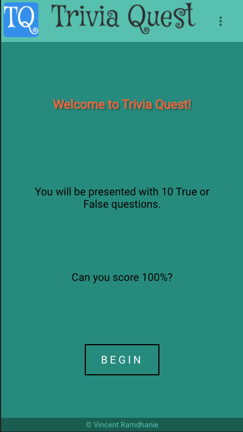
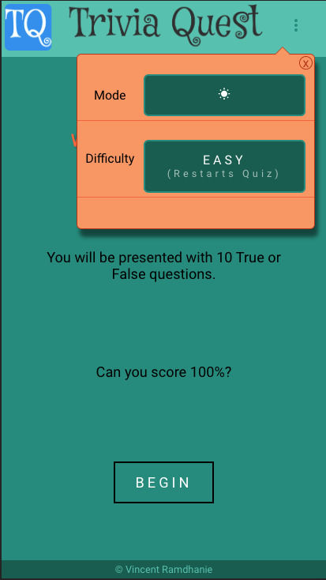
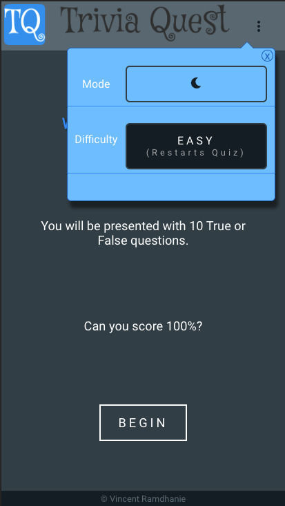
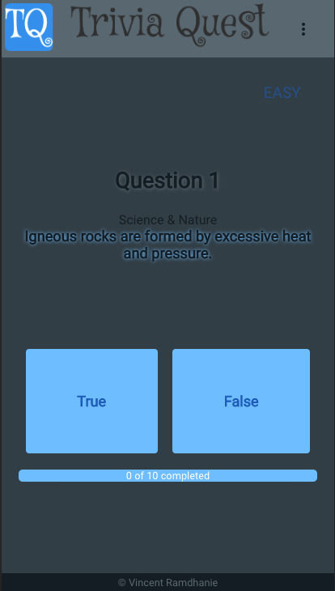
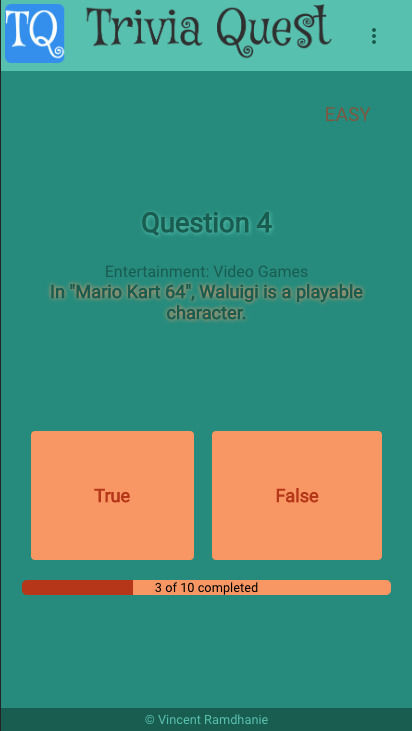
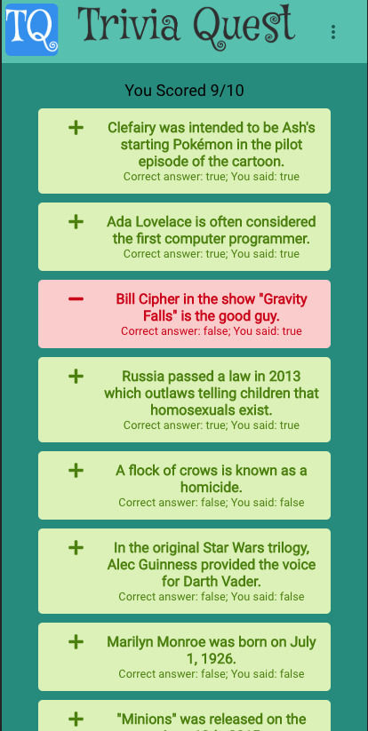

# Trivia Quest &middot;  &middot; 

An exciting Trivia Game that will entertain you for hours. Be the best at your local pub quiz night!

## Table of Contents

- [Demonstration](#demonstration)
- [Installation](#installation)
- [Usage](#usage)
- [Technologies](#technologies)
- [Future Work](#future_work)
- [Contributing](#contributing)
- [Credits](#credits)
- [License](#license)

## Demonstration

To see this app in action visit this [demo site](https://vramdhanie.github.io/quiz).

## Installation

To run the code start by cloning this repository

```bash
git clone https://github.com/vramdhanie/quiz.git
```

then navigate into the new directory:

```bash
cd quiz
```

To install all dependencies:

```bash
npm install
```

To start the development server:

```bash
npm start
```

To run all tests:

```bash
npm test
```

## Usage

This is a fairly simple quiz app. The home screen describes the quiz.



A simple settings menu is provided allowing the user to set the difficulty level or switch between night mode and day mode.



Night Mode uses softer colors that are easier on the eyes.



Clicking the Begin button starts the quiz.



Progress in the quiz is tracked with a simple progress bar. It is possible to switch from night mode at any time.



When the quiz is done teh final score is displayed along with your performance on each question.



A "Play Again" button allow the user to restart the quiz.

## Technologies

Some technologies that were used in making this project:

- This project was bootstrapped with [Create React App](https://github.com/facebook/create-react-app).
- [Styled Components](https://www.styled-components.com/)
- [TypeScript](https://www.typescriptlang.org/)
- [Redux](https://react-redux.js.org/) and [Saga](https://redux-saga.js.org/) for state management
- [React Router](https://reacttraining.com/react-router/web/guides/quick-start) for navigation
- [React Icons](https://react-icons.netlify.com/#/) for simple integration of popular icon libraries

## Future Work

There are several features that are planned for the near future. Here is a suggested road map:

- Calculate some basic stats such as total number right, average and so on
- Use local storage to track returning users
- Create simple server side component to allow users to save progress and compare scores to other users.

## Contributing

Pull requests are welcome. Pull requests are automatically built with Travis and if merged to master will deploy to GH Pages.

## Credits

Initial build by [Vincent Ramdhanie](https://github.com/vramdhanie)

## License

Trivia Quest is [MIT Licensed](LICENSE).
